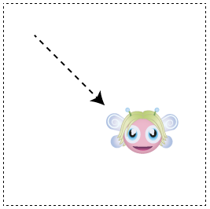
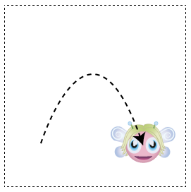
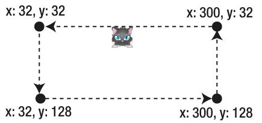
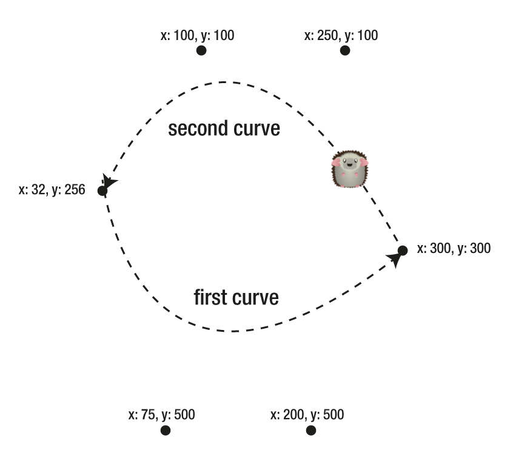

Charm - Tweening for Pixi (v3.0.11)
=========================

Charm is an easy to use tweening library for the [Pixi](https://github.com/GoodBoyDigital/pixi.js/) 2D rendering
engine.

(Important! this library targets Pixi v3.0.11, which is the most stable version of Pixi, and is the only version I can recommend using. This library will eventually be upgraded for Pixi v4 when the v4 branch matures.)

Table of contents
-----------------

[Setting up](#settingup) <br>
[Sliding tweens](#sliding) <br>
[Tween objects](#tweenObjects) <br>
[Setting the easing type](#easingTypes) <br>
[Following curves](#followingCurves) <br>
[Following paths](#followingPaths) <br>
[Following connected curves](#followingConnectedCurves) <br>
[Fade-out and fade-in](#fade) <br>
[Pulse](#pulse) <br>
[Scale](#scale) <br>
[Breathe](#breathe) <br>
[Strobe](#strobe) <br>
[Wobble](#wobble) <br>
[Make your own custom tweens](#custom) <br>

<a id="settingup"></a>
Setting up and running Charm
----------------------------
To start using Charm, link to the `charm.js` file in your HTML
document with a `<script>` tag. 
Next, create a new instance of Charm at the beginning of your program,
and initialize it using the `PIXI` object in the constructor, like this:
```js
c = new Charm(PIXI);
```
Charm needs to be updated each frame in your application's game loop.
Call charm's `update` method in the game loop. Here's an example of a
simple game loop that updates Charm:
```js
function gameLoop(){

  //Create the loop
  requestAnimationFrame(gameLoop);

  //Update charm
  c.update();

  //Optionally, you probably also need to render Pixi's root
  //container. If your root container is called `stage` you could
  //update it like this:
  //PIXI.renderer.render(stage);
}
```
Now you're ready to start tweening!

Let's learn how to use Charm by looking in-depth at one its most
useful methods: `slide`.

<a id="sliding"></a>
Sliding tweens
--------------

Use Charm's `slide` method to make a sprite move 
smoothly from its current position on the canvas, to any other position. 
The `slide` method takes 7 arguments (but only the first 3 are required): 
```js
slide(
  anySprite,              //A sprite
  finalXPosition,         //The x position where the movement should end
  finalYPosition,         //The y position where the movement should end
  durationInFrames,       //How long the movement should last, in frames
  easingType,             //The easing style of the movement
  yoyo?,                  //A Boolean. Should the sprite yoyo?
  delayTimeBeforeRepeat   //Delay time, in ms, before the sprite yoyos.
)
```
`durationInFrames` determines the number of frames over which the tween should occur (the default is 60.) 
The `easingType` is a string which can be any of 15 different types, which you'll find 
listed ahead (the default is "smoothstep".) `yoyo` is a Boolean which determines whether 
the sprite should move back and forth, continuously between the tween's start and end points. 
`delayTimeBeforeRepeat` is a number, in milliseconds, that determines the amount of optional 
delay between before the sprite yoyos back.

Here's how you could use the `slide` method to make a sprite move from its original position 
to x/y point 128/128 over 120 frames:
```js
c.slide(anySprite, 128, 128, 120);
```
That's the only line of code you need to write – Charm's engine animates the sprite automatically 
for you. Here's the effect it produces:
  

  
If you want the sprite to yoyo back and forth between its start and end points, 
here's some code you could write:
```js
c.slide(pixie, 128, 128, 120, "smoothstep", true);
```
(`true` turns the yoyo effect on.)

<a id="tweenObjects"></a>
Tween objects
-------------

All of Charm's tween methods return a tween object, that you can create like this:
```js
let slideTween = c.slide(anySprite, 128, 128, 120);
```
`slideTween` is the tween object in this example, and it contains some useful properties 
and methods that let you control the tween.
One of these is a user-assignable `onComplete` method that will run as soon as the tween 
is finished. Here's how you could use `onComplete` to display a message in the console 
when the sprite has reached its destination.
```js
let slideTween = c.slide(anySprite, 128, 128, 120);
slideTween.onComplete = () => console.log("slide completed");
```
If you set `yoyo` to `true`, `onComplete` will run whenever the sprite reaches both its 
start and end points, continuously.

Tweens also have `pause` and `play` methods that let you stop and start the tween.
```
slideTween.pause();
slideTween.play();
```
Tween objects have a `playing` property that will be `true` if the tween is currently playing. 
All Charm's methods return tween objects that you can control and access like this.

<a id="easingTypes"></a>
Setting the easing types
------------------------

The `slide` method's fourth argument is the `easingType`. It's a string that determines how 
quickly or slowly the tween speeds up and slows down. There are 15 of these types to choose 
from, and they're the same for all of Charm's different tween methods. The easing types fall 
in to 5 general categories, so you can pick one by first choosing the general category, and 
then the more specific type. Each category has a basic type, and then a squared and cubed 
version. The squared and cubed versions just exaggerate the basic effect to further degrees. 
The default easing type for most of Charm's tweens is "smoothstep". 

-	**Linear**: "linear". No easing on the sprite at all; the sprite just starts and stops abruptly.
- **Smoothstep**: "smoothstep", "smoothstepSquared", "smoothstepCubed". Speeds the sprite up and slows it down in a very natural looking way.
- **Acceleration**: "acceleration", "accelerationCubed". Gradually speeds the sprite up and stops it abruptly. For a slightly more rounded acceleration effect, use "sine", "sineSquared", "sineCubed",
-	**Deceleration**: "deceleration", "decelerationCubed". Starts the sprite abruptly and gradually slows it down. For a slightly more rounded deceleration effect, use "inverseSine", "inverseSineSquared", "inverseSineCubed"
- **Bounce**: "bounce 10 -10". This will make the sprite overshoot the start and end points and bounce slightly when it hits them. Try changing the multipliers, 10 and -10, to vary the effect. 

Use any of these easing types in Charm's tween methods in the examples that follow.

<a id="followingCurves"></a>
Following curves
----------------

The `slide` method animates a sprite along a straight line, but you
can use another method called `followCurve` to make a sprite move along a Bezier curve. 



First, define the Bezier curve as a 2D array of 4 x/y points, like this:
```js
let curve = [
  [anySprite.x, anySprite.y],   //Start position
  [108, 32],                    //Control point 1
  [176, 32],                    //Control point 2
  [196, 160]                    //End position
];
```
The second and third set of points are the Bezier curve's control
points.

Next, use Charm's `followCurve` method to make a sprite follow that curve. 
(Supply the `curve` array as the second argument.)
```js
c.followCurve(
  anySprite,            //The sprite
  curve,                //The Bezier curve array
  120,                  //Duration, in milliseconds
  "smoothstep",         //Easing type
  true,                 //Should the tween yoyo?
  1000                  //Delay, in milliseconds, before it yoyos
);
```
Only the first two arguments are required.

You'll have the best result if you center the sprite over the curve. 
You can do that by centering the sprite's anchor point, like this:
```js
anySprite.anchor.set(0.5, 0.5);
```
The `slide` and `followCurve` methods are good for simple back and forth animation effects, 
but you can also connect them together to make sprites traverse complex paths.

<a id="followingPaths"></a>
Following paths
---------------

You can use Charm's `walkPath` method to connect a series of points together and 
make a sprite move to each of those points. Each point in the series is called a 
**waypoint**. First, start with a 2D array of x/y position waypoints that map out 
the path you want the sprite to follow.
``` js
let waypoints = [
  [32, 32],          //First x/y point
  [32, 128],         //Next x/y point
  [300, 128],        //Next x/y point
  [300, 32],         //Next x/y point
  [32, 32]           //Last x/y point
];
```
You can use as many waypoints as you need.

Next, use the `walkPath` method to make the sprite move to all those points, in sequence. 
(Only the first two arguments are required.)
```js
c.walkPath(
  anySprite,       //The sprite
  waypoints,       //The array of waypoints
  300,             //Total duration, in frames
  "smoothstep",    //Easing type
  true,            //Should the path loop?
  true,            //Should the path reverse?
  1000             //Delay in milliseconds between segments
); 
```
If you set the 5th argument to `true`, the sprite will start again from the beginning 
when it reaches the end. If you set the 6th argument to `true`, the sprite will walk 
the path in reverse when it reaches the end. The last argument sets the delay, in 
milliseconds, that the sprite should wait before moving to the next section of the path. 

Here's the effect of this code:



<a id="followingConnectedCurves"></a>
Following connected curves
----------------

You can make a sprite follow a series of connected curves with the
`walkCurve` method. First, create any array of Bezier curves that describe the path you
want the sprite to follow.
```js
let curvedWaypoints = [

    //First curve
    [[anySprite.x, anySprite.y],[75, 500],[200, 500],[300, 300]],

    //Second curve
    [[300, 300],[250, 100],[100, 100],[anySprite.x, anySprite.y]]
];
```
The four points for each curve are the same as in the `followCurve` method: the start position, 
control point 1, control point 2, and the end position. The last point in the first curve 
should be the same as the first point in the next curve. You can use as many curves as you need.

Next, supply the `curvedWapoints` array as the second argument in the walkCurve method:
```js
let spritePath = c.walkCurve(
  anySprite,                    //The sprite
  curvedWaypoints,              //Array of curved waypoints
  300,                          //Total duration, in frames
  "smoothstep",                 //Easing type
  true,                         //Should the path loop?
  true,                         //Should the path yoyo?
  1000                          //Delay in milliseconds between segments
);
```
Here's the effect of this code:



Using `walkPath` and `walkCurve` will give you a great head start for making some fun 
animated sprites for games.

Charm has bunch of other built-in, tween effects that you'll find a lot of use for in 
games and applications. Here's a quick round-up:

<a id="fade"></a>
Fade-out and fade-in
--------------------

Use `fadeOut` to make a sprite become gradually transparent, and
`fadeIn` to make it re-appear. Here's their most basic usage:
```js
c.fadeOut(anySprite);
c.fadeIn(anySprite);
```
The optional second argument is the duration, in frames, that the fade should 
last (the default is 60 frames.)

<a id="pulse"></a>
Pulse
-----

Use `pulse` to make a sprite fade out and in, continuously, at a steady rate.
```js
c.pulse(anySprite);
```
The optional second argument is the duration, in frames, between each fade-in and fade-out. 
An optional 3rd argument lets you set the minimum alpha level that the sprite should 
be reduced to. For example, if you only want the sprite to become half-transparent before 
fading in again, set the 3rd argument to `0.5`, like this:
```js
c.pulse(anySprite, 60, 0.5);
```

<a id="scale"></a>
Scale
-----

You can tween a sprite's scale with the `scale` method. Here are the arguments you 
can use (only the first is required.)
```js
c.scale(
  anySprite,         //The sprite
  endScaleX,         //The final x scale value
  endScaleY,         //The final y scale value
  durationInframes   //The duration, in frames
);
```

<a id="breathe"></a>
Breathe
-------

If you want the scale tween effect to yoyo back and forth, use the `breathe` method. It's a 
scaling effect that makes a sprite look as though it's breathing in and out. 
Here's the full argument list (only the first is required.)
```js
c.breathe(
  anySprite,          //The sprite
  endScaleX,          //The final scale x value
  endScaleY,          //The final scale y value
  frames,             //The duration, in frames
  yoyo,               //Should the tween yoyo?
  delayBeforeRepeat,  //Delay, in milliseconds, before yoyoing
);
```

<a id="strobe"></a>
Strobe
------

Use the `strobe` method to make a sprite appear to flash like a strobe light by 
rapidly changing its scale.
```js
c.strobe(sprite);
```

<a id="wobble"></a>
Wobble
------

Make a sprite wobble like a plate of jelly using the `wobble` method:
```js
c.wobble(sprite);
```
If you use any of these scaling tween effects (`scale`, `breathe`,
`strobe` or `wobble`), center the sprite's anchor point so that the scaling happens 
from the sprite's center.

<a id="custom"></a>
Make your own custom tweens
---------------------------

These tweening effects will cover most of your needs for all kinds of
games and
applications. But, if you need a new effect, try
writing your own. Use Charm's existing methods as your template, and if you
create something really fun, let us know and we'll add it to the
library!


